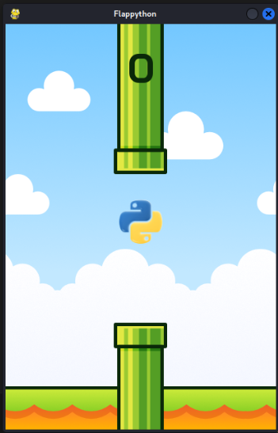

# 🐍 Flappython

Flappython is a fun and addictive Python-powered arcade game inspired by the classic **Flappy Bird** — but with a twist! You control the **Python logo** as it soars between pipes in a bright and colorful world.



## 🎮 Gameplay

- **Objective**: Fly your Python through an endless series of pipes without crashing.
- **Controls**: 
  - Press `SPACE` to flap.
  - Avoid hitting the pipes or falling out of bounds.
- **Scoring**: You earn a point each time you pass between pipes.

## 🧠 Features

- Clean retro visuals with smooth side-scrolling.
- Background and ground scrolling for immersive motion.
- Realistic gravity and jump mechanics.
- Fun sound effects:
  - **Woosh** when jumping
  - **Slap** when crashing
  - **Ding** when scoring
- High-performance rendering at 60 FPS using **Pygame**.
- A cool little Python logo as the player avatar

## 🗂️ Project Structure
Flappython/
├── fonts/
│ └── BaiJamjuree-Bold.ttf
├── sounds/
│ ├── slap.wav
│ ├── score.wav
│ └── woosh.wav
├── images/
│ ├── player.png ← Your Python logo (64x62 PNG)
│ ├── pipe_up.png
│ ├── pipe_down.png
│ ├── ground.png
│ └── background.png
├── flappython.py
└── README.md

## 🔧 Requirements

- Python 3.7+
- Pygame

Install with:

```bash
pip install pygame

